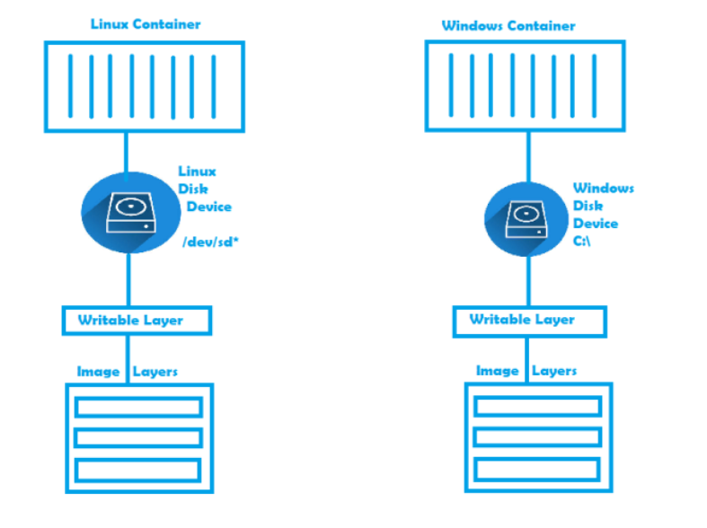
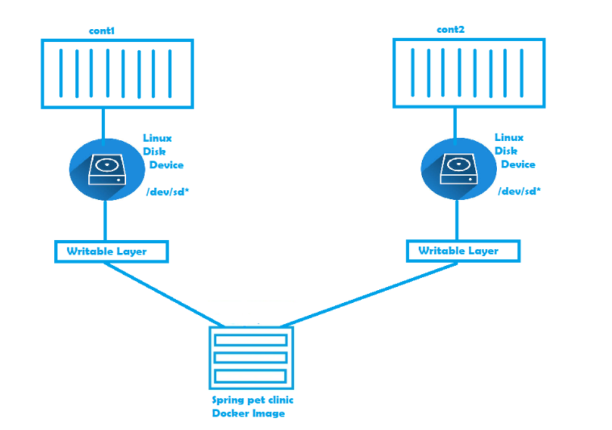
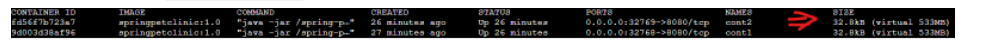

### Impact of Image Layers on Docker Containers & Storage Drivers

#### Docker Image Layers and containers
* Please [Refer Here](https://github.com/codesquareZone/Docker-Image-Layers-and-containers-Part-2/blob/master/dc.md). As the earlier post is prerequisite for understanding this series
* We have understood, Docker images are collection of Layers.
* Now Let us try to understand how the docker image layers will work in the case of container

* Execute the following commands
```
docker container run --name cont1 -d -P springpetclinic:1.0 
docker container run --name cont2 -d -P springpetclinic:1.0 
```

* As per the image we can make out the changes done in one container will not impact other container as every container has its own writable layer.
* To understand actual size on disk, execute the following command `docker ps -s`

In the above image **size =>** amount of data used for writable layer, **virtual size =>** virtual size of container i.e. image layers size plus writable layer size
* When any container tries to change the contents of the existing files in image layers (As we are aware image layers are readonly), then the file which is supposed to be changed is copied into the write layer of the container and the modifications will be present only for the container changing it.
* One of the major advantage with this approach is storage optimization in terms of space occupied on disk in the case of multiple container running.
* There is also one challenge. The write layer is avaiable only as long as container is alive. The moment container is removed from the machine, the writable layer is also deleted.
* To overcome this challenge lets understand
   * Storage Drivers
   * Persist Data in Containers

### Storage Drivers
* Storage Drivers allow you to create the data in the writable layer of the container
* Docker supports the following storage drivers
    * **overlay2 :**
        * Preferred storage driver for all linux distributions
        * Requires no extra configuration
    * **aufs :**
        * is the preferred storage driver for Docker 18.06 and older, when running on Ubuntu 14.04 on kernel 3.13 which has no support for **overlay2**
    * **devicemapper :**
        * Requires direct-lvm for production environments
        * zero configuration is available but has poor performance
        * devicemapper was the recommended storage driver for CentOS and RHEL, as their kernel version did not support overlay2, However current versions of Centos & RHEL support **overlay2** now
    * **btrfs:**
        * used if the hosts file system is btrfs
        * snapshots are supported
    * **zfs:**
        * used if the hosts file system is zfs
        * snapshots are supported
* To know your current storage driver, execute “`docker info“ and you should see Section **Storage Driver.** The docker info output would be like
```
Client:
 Debug Mode: false

Server:
 Containers: 2
  Running: 2
  Paused: 0
  Stopped: 0
 Images: 5
 Server Version: 19.03.1
 Storage Driver: overlay2
  Backing Filesystem: xfs
  Supports d_type: true
  Native Overlay Diff: true
 Logging Driver: json-file
 Cgroup Driver: cgroupfs
 Plugins:
  Volume: local
  Network: bridge host ipvlan macvlan null overlay
  Log: awslogs fluentd gcplogs gelf journald json-file local logentries splunk syslog
 Swarm: inactive
 Runtimes: runc
 Default Runtime: runc
 Init Binary: docker-init
 containerd version: 894b81a4b802e4eb2a91d1ce216b8817763c29fb
 runc version: 425e105d5a03fabd737a126ad93d62a9eeede87f
 init version: fec3683
 Security Options:
  apparmor
  seccomp
   Profile: default
 Kernel Version: 4.4.0-161-generic
 Operating System: Alpine Linux v3.10 (containerized)
 OSType: linux
 Architecture: x86_64
 CPUs: 8
 Total Memory: 31.4GiB
 Name: node1
 ID: GMFB:TJ5T:GKDZ:3TQO:I52L:7OC4:WVGJ:INCL:J7MW:O626:GODK:URGN
 Docker Root Dir: /var/lib/docker
 Debug Mode: true
  File Descriptors: 40
  Goroutines: 54
  System Time: 2019-09-27T13:11:57.45011439Z
  EventsListeners: 0
 Registry: https://index.docker.io/v1/
 Labels:
 Experimental: true
 Insecure Registries:
  127.0.0.1
  127.0.0.0/8
 Live Restore Enabled: false
 Product License: Community Engine
```
* To Know more about configuration, click on storage driver
   * [aufs](https://docs.docker.com/storage/storagedriver/aufs-driver/)
   * [Btrfs](https://docs.docker.com/storage/storagedriver/btrfs-driver/)
   * [Device Mapper](https://docs.docker.com/storage/storagedriver/device-mapper-driver/)
   * [Overlay](https://docs.docker.com/storage/storagedriver/overlayfs-driver/)
   * [Zfs](https://docs.docker.com/storage/storagedriver/zfs-driver/)
* VFS storage driver is still
* What is better for my workload. [Refer Here](https://docs.docker.com/storage/storagedriver/select-storage-driver/#suitability-for-your-workload)   

